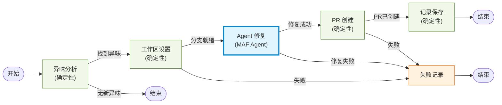
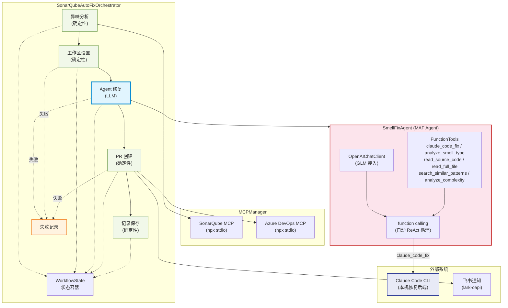
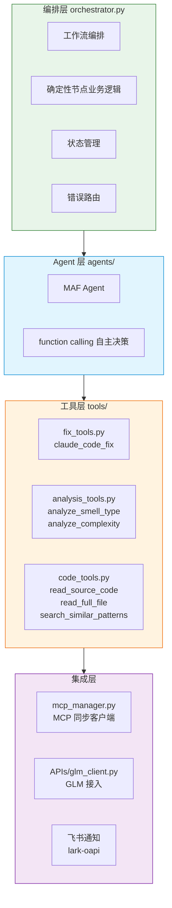
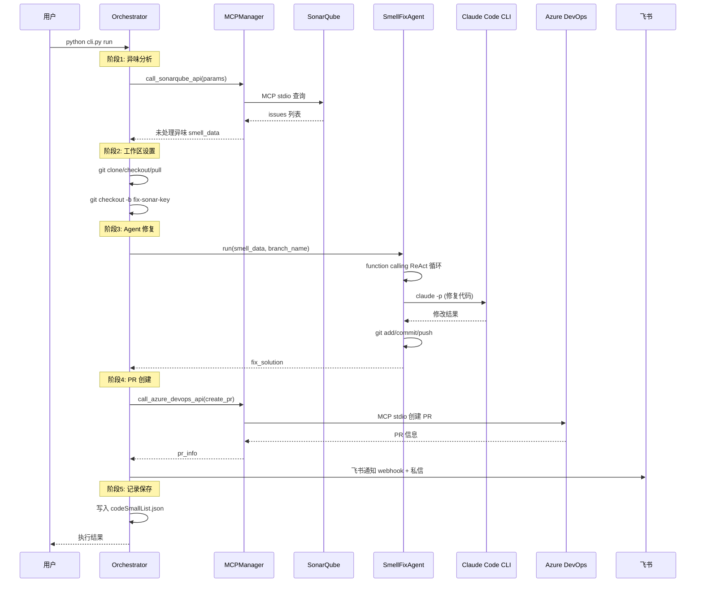
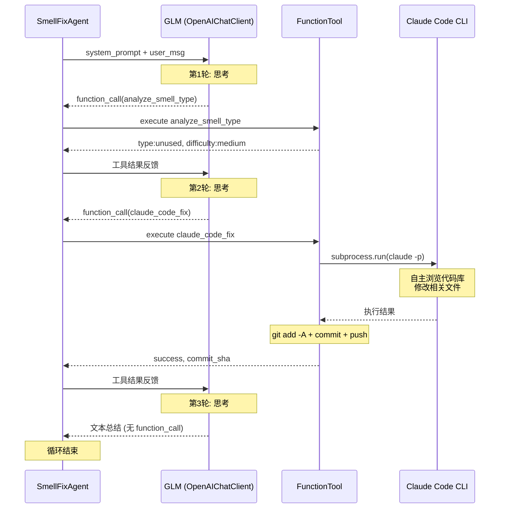
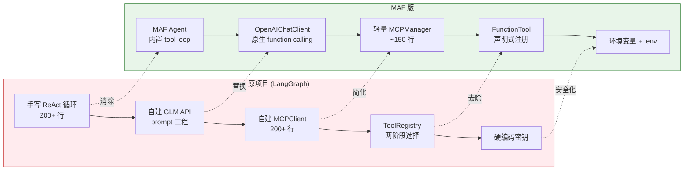

# SonarQube 代码异味自动修复系统 - 技术文档

> **文档性质**：教学型技术文档
> **适用版本**：MAF 版 (Microsoft Agent Framework 1.10.0)
> **编写日期**：2026-07-03

---

## 目录

- [一、项目概述](#一项目概述)
- [二、技术栈详解](#二技术栈详解)
- [三、解决的核心问题](#三解决的核心问题)
- [四、架构设计](#四架构设计)
- [五、运行时数据流](#五运行时数据流)
- [六、关键设计决策](#六关键设计决策)
- [七、与原项目的对比](#七与原项目的对比)

---

## 一、项目概述

### 1.1 系统定位

本系统是一个 **SonarQube 代码异味自动修复流水线**。它从 SonarQube 获取未处理的代码异味（Code Smell），通过 AI Agent 自主决策修复方案，调用 Claude Code CLI 执行代码修改，最终在 Azure DevOps 上创建 Pull Request 并通过飞书通知负责人。

### 1.2 核心能力

```
SonarQube 异味发现 → Git 工作区准备 → AI Agent 自主修复 → PR 创建 → 飞书通知 → 记录归档
```

- **异味发现**：通过 MCP 协议查询 SonarQube，分页获取未处理的 CRITICAL 级别 CODE_SMELL
- **自主修复**：MAF Agent 通过 function calling 自主选择工具、多轮调用完成修复
- **统一修复后端**：所有修复任务交给本机 Claude Code CLI，支持跨文件修改
- **自动化交付**：自动创建分支、提交、推送、创建 PR、通知负责人


#### 工作流总览图


### 1.3 与原项目的区别

原项目基于 LangGraph 构建，本项目使用 Microsoft Agent Framework (MAF) 重建了框架层，业务逻辑完整复用。核心差异在于 ReAct 循环从手写 200+ 行变为框架内置，MCP 从自建运行时变为轻量封装。

---

## 二、技术栈详解

### 2.1 Microsoft Agent Framework (MAF)

**是什么**：MAF 是微软面向 Agentic AI 的开发框架，融合了 AutoGen 的 Agent 抽象能力和 Semantic Kernel 的企业级特性。Python 包名为 `agent-framework`，当前版本 1.10.0（GA 稳定版）。

**在本项目中的角色**：提供 Agent 抽象和内置 tool loop，取代原项目手写的 ReAct 循环。

**核心 API 使用**：

```python
from agent_framework import Agent
from agent_framework.openai import OpenAIChatClient

# 1. 创建 LLM 客户端（GLM 通过 OpenAI 兼容接口接入）
client = OpenAIChatClient(model="glm-5", api_key="...", base_url="...")

# 2. 声明式创建 Agent（工具直接传入，框架自动处理 ReAct 循环）
agent = Agent(
    client=client,
    name="SmellFixAgent",
    instructions="你是一个代码异味修复 Agent...",
    tools=[claude_code_fix, analyze_smell_type, read_source_code, ...],
)

# 3. 运行（框架自动完成：思考→选工具→执行→观察→再思考）
response = await agent.run("请处理以下代码异味...")
```

**为什么选择 MAF 而非继续用 LangGraph**：

| 维度 | LangGraph (原项目) | MAF (本项目) |
|------|-------------------|-------------|
| ReAct 循环 | 手写 200+ 行（LLM调用→JSON解析→工具路由→重试） | 框架内置，声明式定义 |
| 工具调用 | prompt 工程让 LLM 输出 JSON，手动解析路由 | 原生 function calling，框架自动路由 |
| MCP 集成 | 自建 MCPClient（event loop + daemon thread） | 框架原生 MCPStdioTool + 轻量同步封装 |
| 工具选择 | ToolRegistry 两阶段选择（规则筛选+LLM决策） | LLM 通过 function calling 自动选择 |

### 2.2 OpenAIChatClient + GLM

**是什么**：MAF 提供的 OpenAI 兼容 ChatClient，可接入任何兼容 OpenAI `/v1/chat/completions` 接口的 LLM 后端。

**在本项目中的角色**：接入企业内部部署的 GLM 模型（智谱 AI），启用原生 function calling。

**关键技术点**：

GLM 提供 OpenAI 兼容接口，因此无需编写 Custom Provider。只需配置 `base_url` 指向 GLM 服务端点：

```python
client = OpenAIChatClient(
    model=Config.GLM_MODEL,        # "glm-5" 或 "glm-5.2"
    api_key=Config.GLM_API_KEY,
    base_url=Config.GLM_BASE_URL,  # "https://ai-infra.united-imaging.com"
    instruction_role="system",
)
```

> **重要**：原项目因 GLM-5 不支持 function calling，被迫用 prompt 工程让 LLM 输出 JSON，再手动解析路由工具。MAF 的 Agent + function calling 要求 LLM 原生支持工具调用。若 GLM 模型支持 function calling（如 glm-5.2），则 MAF 的 tool loop 可直接原生工作；若不支持，则需回退到 prompt 工程方案。

### 2.3 MCP (Model Context Protocol)

**是什么**：MCP 是连接 AI Agent 与外部数据源/工具的开放标准协议，通过 stdio 或 HTTP 传输，提供标准化的工具发现和调用机制。

**在本项目中的角色**：连接两个外部系统：
- **SonarQube MCP Server**（`sonarqube-mcp-server`，npx stdio 模式）：查询代码异味
- **Azure DevOps MCP Server**（`@tiberriver256/mcp-server-azure-devops`，npx stdio 模式）：创建 PR

**MAF 对 MCP 的原生支持**：

```python
from agent_framework import MCPStdioTool

# MAF 原生 stdio MCP 工具（设计为 Agent 通过 function calling 调用）
sonarqube_tool = MCPStdioTool(
    name="sonarqube",
    command="npx",
    args=["--yes", "sonarqube-mcp-server@latest"],
    env={"SONARQUBE_URL": "...", "SONARQUBE_USERNAME": "...", "SONARQUBE_PASSWORD": "..."},
)
```

**本项目的处理方式**：由于 `issue_analysis` 和 `pr_creation` 是确定性节点（不需要 LLM 决策），直接编程式调用 MCP 更合适。因此实现了轻量 `MCPManager`（~150 行），而非全用 `MCPStdioTool`。详见 [架构设计](#四架构设计)。

### 2.4 Claude Code CLI

**是什么**：Anthropic 提供的命令行工具（`claude`），能自主浏览代码库、理解上下文、修改文件并提交。

**在本项目中的角色**：作为统一的代码修复后端。无论异味简单还是复杂、单文件还是多文件，一律通过 `claude_code_fix` 工具调用 Claude Code CLI 完成。

**调用方式**：

```python
cmd = [claude_path, "-p", "--dangerously-skip-permissions", "--max-turns", "100"]
result = subprocess.run(cmd, cwd=repo_path, input=prompt, capture_output=True, text=True, timeout=300)
```

- `-p`：非交互模式（pipe 模式），通过 stdin 传入 prompt
- `--dangerously-skip-permissions`：跳过权限确认，允许自动编辑文件
- prompt 通过 stdin 传递（避免 Windows 命令行参数长度限制）

### 2.5 其他技术

| 技术 | 用途 |
|------|------|
| GitPython | Git 仓库操作（clone/checkout/commit/push） |
| lark-oapi | 飞书私信通知（向负责人发送 PR 链接） |
| Rich | 终端 UI（Panel/Table/彩色输出） |
| python-dotenv | 环境变量管理（.env 文件） |
| Pydantic | 工具参数 schema 定义（MAF FunctionTool 依赖） |

---

## 三、解决的核心问题

本项目针对原 LangGraph 版本的 5 个核心架构痛点进行了针对性改造。

### 3.1 问题一：手写 ReAct 循环维护成本高

**原项目痛点**：`tools/smell_fix_agent.py` 中的 `_react_loop()` 方法手写了完整的 ReAct 循环，包括 LLM 调用、自定义 JSON 解析器、工具路由、结果反馈、迭代控制、错误处理，共 200+ 行代码。

```
原项目 ReAct 循环流程（手写）：
  for iteration in range(MAX_ITERATIONS):
      response = call_glm_messages(messages)      # 调用 LLM
      decision = self._parse_agent_response(response)  # 手写 JSON 解析
      if not decision: continue                   # 解析失败重试
      if action == "FINISH": return result        # 完成判断
      tool_result = tool.safe_run(**action_input) # 手动工具路由
      messages.append({"role": "user", "content": f"工具结果: {result}"})  # 手动反馈
```

**MAF 解决方案**：Agent + Tool loop 是框架内置的。只需声明 Agent 和 Tools，框架通过 function calling 自动完成整个循环。

```python
# MAF 方案：声明式定义，框架自动处理 ReAct 循环
agent = Agent(
    client=glm_client,
    instructions=AGENT_SYSTEM_PROMPT,
    tools=[claude_code_fix, analyze_smell_type, read_source_code, ...],
)
response = await agent.run("请处理以下代码异味...")  # 框架自动处理循环
```

**收益**：200+ 行手写循环 → 3 行声明式定义。无需维护 JSON 解析器、迭代控制、工具路由逻辑。

### 3.2 问题二：自建 MCPClient 运行时复杂

**原项目痛点**：`main.py` 中的 `MCPClient` 类（81-307 行）自建了完整的 MCP 运行时：后台 event loop、daemon thread、AsyncExitStack 管理 stdio 传输、工具名缓存和动态解析、atexit 清理。

**MAF 解决方案**：MAF 原生提供 `MCPStdioTool`（用于 Agent 工具）和 MCP SDK（用于编程式调用）。本项目实现轻量 `MCPManager`（~150 行），仅保留必需的同步调用能力，去除了手动 event loop / thread 管理。

**收益**：200+ 行 → ~150 行，复杂度降低约 30%，且更易理解和维护。

### 3.3 问题三：工具选择机制冗余

**原项目痛点**：`ToolRegistry` 实现两阶段选择——先用规则筛选候选工具集，再交给 LLM 决策。这是因为 GLM-5 不支持 function calling，需要缩小工具集降低选择难度。

**MAF 解决方案**：MAF 的 Agent 通过原生 function calling 由 LLM 自动选择工具，无需手动缩小候选集。所有工具直接声明式注册到 Agent。

```python
# 原项目：两阶段选择
active_tools = registry.select_tools(smell_type=..., smell_rule=..., smell_message=...)
# → 规则筛选 always_include + 标签匹配 + 关键词匹配 + 高频统计

# MAF 方案：直接全部注册，LLM 自动选择
agent = Agent(client=client, tools=[全部6个工具])
```

**收益**：去除 ToolRegistry + BaseTool 体系（~150 行），工具选择交给 LLM 原生 function calling。

### 3.4 问题四：GLM 接入未启用 function calling

**原项目痛点**：`APIs/glm_5_api.py` 使用自建 requests 封装调用 GLM，model 参数为 `"glm-5"`，通过 prompt 工程让 LLM 输出 JSON 并手动解析。GLM 的 function calling 能力未被释放。

**MAF 解决方案**：通过 MAF 的 `OpenAIChatClient` 接入 GLM（OpenAI 兼容接口），原生支持 function calling。Agent 的 tool loop 由框架通过 function calling 协议驱动，无需 prompt 工程和 JSON 解析。

**收益**：自建 API 封装（~150 行）→ MAF 客户端（3 行），且 function calling 比 prompt 工程更可靠。

### 3.5 问题五：密钥硬编码

**原项目痛点**：API Key、飞书 App Secret、Azure DevOps PAT、SonarQube 密码均硬编码在源文件中。

**MAF 解决方案**：统一改为环境变量 + `.env` 文件，通过 `python-dotenv` 加载。

```python
# 原项目：硬编码
GLM_API_KEY = "sk-8GRnrW6jlWi8sVPw81B6MmkYVC8JKENt5T10uB0ufunTJYRr"

# MAF 版：环境变量
GLM_API_KEY = os.environ.get("GLM_API_KEY", "fallback-for-dev")
```

---

## 四、架构设计

### 4.1 整体架构



> **图例**：绿色 = 确定性节点（编程式调用），蓝色 = LLM 节点（Agent 自主决策），橙色 = 失败路径，粉色 = MAF Agent 内部，靛蓝 = 外部修复后端
### 4.2 分层设计



系统分为四层，每层职责清晰：

**第一层：编排层** (`orchestrator.py`)
- 总控制器，定义工作流的 5 个阶段和失败处理路径
- 管理 WorkflowState 在阶段间传递
- 负责阶段间的错误路由（失败时进入 failure_record）

**第二层：Agent 层** (`agents/smell_fix_agent.py`)
- MAF Agent，处理需要 LLM 决策的修复阶段
- 通过 function calling 自主选择和调用工具
- 是原项目手写 ReAct 循环的替代

**第三层：工具层** (`tools/`)
- 6 个 MAF FunctionTool，供 Agent 通过 function calling 调用
- 修复工具（claude_code_fix）：核心修复能力
- 分析工具（analyze_smell_type, analyze_complexity）：辅助理解异味
- 代码读取工具（read_source_code, read_full_file, search_similar_patterns）：辅助理解上下文

**第四层：集成层** (`mcp_manager.py`, `APIs/glm_client.py`)
- MCPManager：连接 SonarQube 和 Azure DevOps MCP 服务器
- GLM 客户端：通过 OpenAIChatClient 接入 GLM 模型
- 飞书通知：群组 webhook + 私信 lark-oapi

### 4.3 模块职责一览

| 模块 | 职责 | 行数 | 对应原项目 |
|------|------|------|-----------|
| `orchestrator.py` | 工作流编排 + 确定性节点 + 飞书通知 | ~480 | main.py (1129-1320) |
| `agents/smell_fix_agent.py` | MAF Agent 修复异味 | ~170 | tools/smell_fix_agent.py (全文) |
| `mcp_manager.py` | MCP 同步客户端 | ~150 | main.py MCPClient (81-307) |
| `tools/fix_tools.py` | Claude Code CLI 修复工具 | ~180 | tools/claude_tools.py (全文) |
| `tools/analysis_tools.py` | 异味分类 + 复杂度分析 | ~100 | tools/analysis_tools.py (全文) |
| `tools/code_tools.py` | 代码读取 + 模式搜索 | ~110 | tools/code_tools.py (全文) |
| `APIs/glm_client.py` | GLM 接入 | ~20 | APIs/glm_5_api.py (全文) |
| `config.py` | 配置管理 | ~100 | config.py (全文) |

### 4.4 确定性节点 vs LLM 节点

工作流中的 5 个阶段分为两类：

**确定性节点**（直接编程式调用，不经过 LLM）：
- `issue_analysis`：分页查询 SonarQube，筛选未处理异味
- `workspace_setup`：Git clone/checkout/创建分支
- `pr_creation`：调用 Azure DevOps API 创建 PR
- `record_keeping` / `failure_record`：读写 JSON 记录文件

**LLM 节点**（通过 MAF Agent 自主决策）：
- `agent_fix`：SmellFixAgent 通过 function calling 自主选择工具完成修复

这种设计避免了将确定性逻辑交给 LLM（减少 token 消耗和不确定性），同时让需要智能决策的修复阶段充分利用 Agent 的自主能力。

---

## 五、运行时数据流

### 5.1 完整数据流概览


**失败路径**：任何阶段出错时，若已有 smell_data，则进入 `failure_record` 记录失败异味（避免重复处理），然后结束。


#### 完整数据流时序图


### 5.2 Agent 内部数据流（阶段 3 详解）

这是整个系统最核心的部分——MAF Agent 通过 function calling 自主完成修复。


**关键对比**：原项目的 `_react_loop` 需要手动处理 JSON 解析失败重试、工具不存在通知、结果截断、迭代次数控制等。MAF Agent 通过 function calling 协议自动处理这些——LLM 返回的是结构化的 function_call（而非需要解析的 JSON 文本），框架自动执行工具并将结果反馈给 LLM。


#### Agent ReAct 循环时序图


### 5.3 数据流中的关键数据结构

**WorkflowState**（工作流状态容器，在阶段间传递）：

```python
class WorkflowState:
    smell_data: dict        # SonarQube 返回的异味信息 {key, rule, message, line, component, author, effort}
    branch_name: str        # Git 分支名 "fix-sonar-{key}-{timestamp}"
    fix_solution: dict      # Agent 修复结果 {filePath, assignee, description, smellKey, commit_sha}
    pr_info: dict           # PR 信息 {id, url, title, status}
    error_info: str         # 错误信息（触发失败路径）
    current_step: str       # 当前阶段
    completed_steps: list   # 已完成阶段列表
```

**smell_data 示例**（来自 SonarQube MCP）：

```json
{
    "key": "AXh3F4DsmF9pXxY7Z0qL",
    "rule": "csharpsquid:S1481",
    "message": "Remove this unused private method.",
    "type": "CODE_SMELL",
    "severity": "CRITICAL",
    "line": 42,
    "component": "WebOIS_wemr-host-csharp:src/Services/ReportService.cs",
    "author": "someone@united-imaging.com",
    "effort": "5min"
}
```

**fix_solution 示例**（来自 MAF Agent）：

```json
{
    "filePath": "src/Services/ReportService.cs",
    "assignee": "a31b511e-6b0f-4894-9c33-c5df5c98608f",
    "description": "Agent 自主修复完成：Claude Code 修改了 1 个文件",
    "smellKey": "AXh3F4DsmF9pXxY7Z0qL",
    "commit_sha": "9a44e78a"
}
```

---

## 六、关键设计决策

### 6.1 为何未使用 MAF WorkflowBuilder

MAF 提供 `WorkflowBuilder` / `Executor` / `Workflow` 用于图式工作流编排。但本项目的原始工作流是简单的线性 DAG，条件路由仅基于 error_info。

使用 MAF WorkflowBuilder 会引入额外复杂度（Executor 定义、Edge 配置、状态序列化），而线性编排 + error 路由用 Python 直接实现更简洁，且行为与原项目完全一致。MAF 的核心价值（Agent + Tool loop）已在 SmellFixAgent 中充分体现。

### 6.2 为何保留轻量 MCPManager 而非全用 MCPStdioTool

MAF 的 `MCPStdioTool` 设计为 Agent 工具（通过 function calling 调用）。但本项目的 `issue_analysis` 和 `pr_creation` 是确定性节点——查询 issues 和创建 PR 不需要 LLM 决策，直接编程式调用 MCP 更高效可靠。

因此实现了极简的 `MCPManager`（~150 行），仅保留：
- `call_sonarqube_api(params)`：查询 SonarQube issues
- `call_azure_devops_api("create_pr", params)`：创建 PR

相比原始 MCPClient（200+ 行），去除了手动 event loop / thread 管理，但仍提供同步调用接口供确定性节点使用。

### 6.3 为何去除 ToolRegistry 两阶段选择

原始 `ToolRegistry` 的两阶段选择（规则筛选 + LLM 决策）是为 GLM-5 不支持 function calling 而设计的——通过缩小工具集降低 LLM 选择难度。

MAF 的 Agent + function calling 由框架自动处理工具选择，LLM 能在完整工具集中自主决策，无需手动缩小候选集。因此所有工具直接声明式注册到 Agent。

### 6.4 为何将修复后端统一为 Claude Code CLI

原项目经过多次演进，最终将所有修复任务统一交给 Claude Code CLI（v2.2.0）。原因：

- **多文件支持**：异味修复常涉及多个关联文件（接口变更、方法重命名等），Claude Code 能自主浏览代码库修改任意文件
- **上下文理解**：Claude Code 能理解整个项目结构，做出更准确的修复
- **统一简化**：无需为不同异味类型维护不同的修复工具

本版本完整保留了这一设计，`claude_code_fix` 作为 MAF FunctionTool 注册到 Agent，由 Agent 通过 function calling 调用。

---

## 七、与原项目的对比



### 7.1 代码量对比

| 模块 | 原项目 | MAF 版 | 变化 |
|------|--------|--------|------|
| ReAct 循环 | 200+ 行 (`_react_loop`) | 0 行 (框架内置) | -100% |
| GLM 接入 | ~150 行 (`glm_5_api.py`) | ~20 行 (`glm_client.py`) | -87% |
| MCP 客户端 | ~230 行 (`MCPClient`) | ~150 行 (`MCPManager`) | -35% |
| 工具注册 | ~150 行 (`BaseTool`+`ToolRegistry`) | 0 行 (声明式) | -100% |
| 工作流编排 | ~190 行 (`StateGraph`) | ~480 行 (含业务逻辑) | +153%* |
| 业务逻辑工具 | ~700 行 | ~700 行 (复用) | 0% |

> *工作流编排增加是因为原项目将确定性节点业务逻辑分散在 main.py 各 Agent 类中，MAF 版合并到 orchestrator.py 中统一管理。框架层代码总量的减少才是核心收益。

### 7.2 框架层代码净减少

```
原项目框架层（非业务逻辑）：
  _react_loop: 200行 + _parse_agent_response: 60行 + MCPClient: 230行
  + ToolRegistry: 150行 + BaseTool: 60行 + glm_5_api: 150行
  = ~850 行框架代码

MAF 版框架层：
  glm_client: 20行 + MCPManager: 150行 + Agent声明: 10行
  = ~180 行框架代码

净减少: ~670 行 (-79%)
```

### 7.3 可靠性提升

| 维度 | 原项目 | MAF 版 |
|------|--------|--------|
| 工具调用可靠性 | 依赖 JSON 解析（3 种容错策略） | function calling 协议（结构化） |
| 工具路由 | 手动 if/else 路由 | 框架自动路由 |
| 迭代控制 | 手动 MAX_ITERATIONS | 框架内置 |
| 错误恢复 | 手动重试逻辑 | 框架内置 |

---

> **文档结束** — 本文档描述了 MAF 版 SonarQube 自动修复系统的技术栈、解决的问题、架构设计和运行时数据流。如需了解迁移过程的具体勘误，请参阅 [迁移实现说明.md](迁移实现说明.md)。